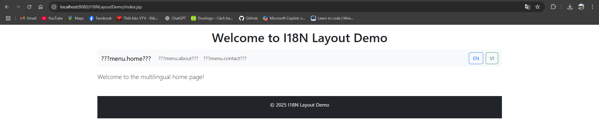
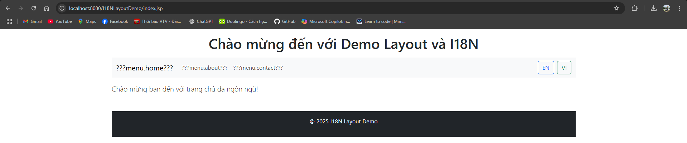

# Layout-I18N-JSP

Dự án mẫu tìm hiểu về **Layout** và **Đa ngữ (Internationalization - I18N)** trong môn học **Lập trình Java nâng cao**.

---

## 🚀 Tính năng

- Sử dụng **layout chung** (`header.jsp`, `footer.jsp`, `menu.jsp`) để tái sử dụng giao diện.
- Hỗ trợ **đa ngữ** (Anh/Việt) với **ResourceBundle** (`messages_en.properties`, `messages_vi.properties`).
- Cho phép **chuyển đổi ngôn ngữ** bằng nút bấm (EN/VI) sử dụng `LanguageController`.
- Sử dụng **Bootstrap 5** để giao diện trực quan, hiện đại.
- Tương thích **Tomcat 10/11** (Jakarta EE).

---

## 📂 Cấu trúc thư mục

```css
I18NLayoutDemo/
│── pom.xml
│── src/
│ └── main/
│ ├── java/com/example/i18n/controller/LanguageController.java
│ ├── resources/messages_en.properties
│ ├── resources/messages_vi.properties
│ └── webapp/
│ ├── layouts/header.jsp
│ ├── layouts/menu.jsp
│ ├── layouts/footer.jsp
│ ├── index.jsp
│ └── about.jsp
│ └── contact.jsp
│── screenshots/
│ ├── layout-home.png
│ └── layout-switch-lang.png
```

---

## ⚙️ Cài đặt & Chạy

### 1. Yêu cầu
- JDK 17+
- Apache Maven 3.8+
- Tomcat 10/11

### 2. Build & Deploy
```bash
mvn clean package
```
Copy file WAR vào thư mục `tomcat/webapps`:
```bash
target/I18NLayoutDemo.war -> tomcat/webapps/I18NLayoutDemo.war
```

### 3. Truy cập
```arduino
http://localhost:8080/I18NLayoutDemo/
```

---

## 🌍 Đổi ngôn ngữ
- Nhấn nút `EN` để chuyển sang tiếng Anh.
- Nhấn nút `VI` để chuyển sang tiếng Việt.

---

## 🖼 Ảnh minh họa
- Giao diện Trang chủ<br>

- Chức năng Chuyển Ngôn ngữ<br>


---

## 📜 Giấy phép
MIT License – Bạn được phép sử dụng, chỉnh sửa, và phân phối.

---
